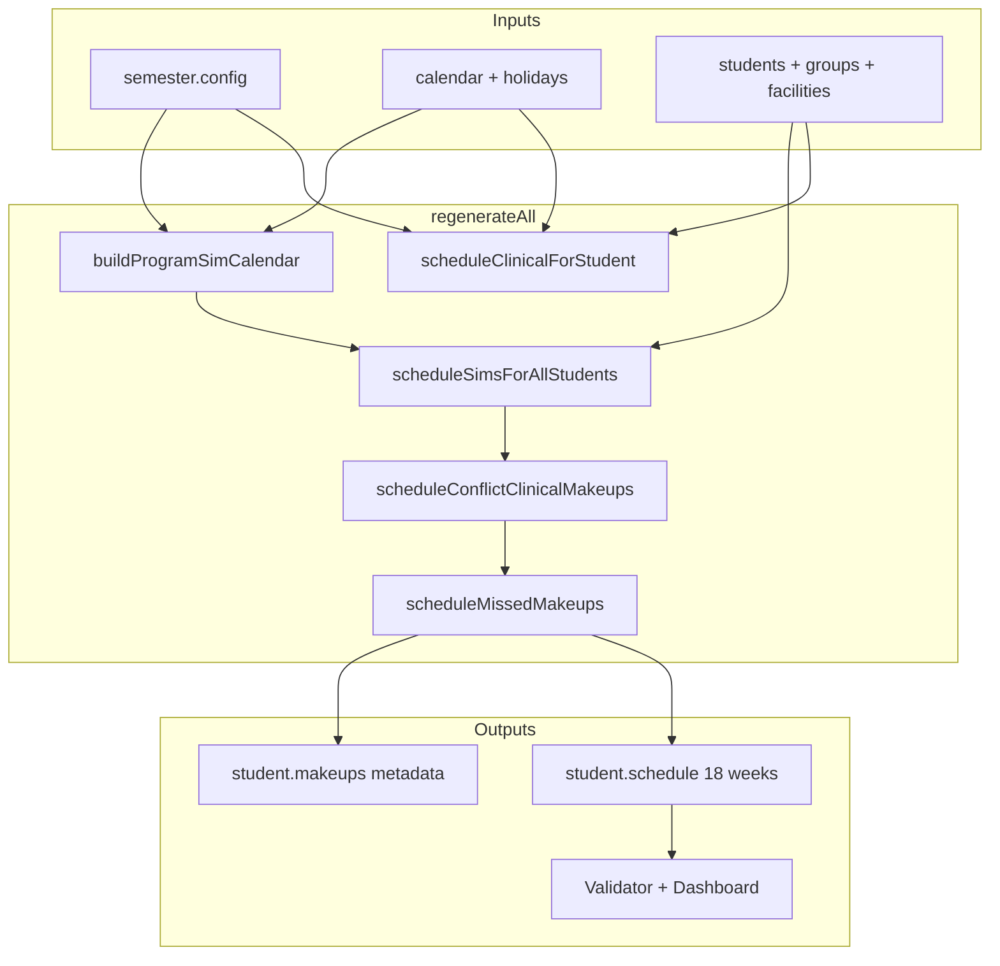

# Project implementation guide

This document summarizes the **Clinical & Simulation Management** app for engineers and agents implementing or extending behavior described in [`000_sim_clinical_tracker.md`](000_sim_clinical_tracker.md) (product scope) and [`Scheduling_rules.md`](Scheduling_rules.md) (scheduling contract). For install, FERPA, and deployment, see [`README.md`](README.md).

---

## 1. What the app does

A **browser-only PWA** (no Microsoft API calls) that:

- Schedules up to **30 students** across **18 weeks** (including break/holiday weeks).
- Tracks **10 clinical days** and **5 simulation days** per student (configurable).
- Assigns students to **clinical groups** (fixed weekday + facility), **simulation groups** (alternating-week pattern), and **registrar sections** (independent of clinical/sim groups).
- Generates and validates schedules, supports **makeup** placement, **role assignments**, **performance flags**, printing, and JSON import/export via **OneDrive** or local files.

**Authoritative scheduling behavior** is defined in [`Scheduling_rules.md`](Scheduling_rules.md). Product features and layout are defined in [`000_sim_clinical_tracker.md`](000_sim_clinical_tracker.md). When code and docs disagree, align code to `Scheduling_rules.md` unless the product scope explicitly overrides.

---

## 2. Architecture (vanilla JS, no build step)

```
index.html
├── css/app.css              UI + print styles
├── js/
│   ├── state.js             App.state, semester switching, dirty flags
│   ├── data-model.js        Schema, defaults, migration, student/semester shapes
│   ├── calendar-engine.js   18-week calendar, holidays, inactive weeks
│   ├── scheduler.js         Clinical + sim generation, makeup slots (core logic)
│   ├── roster-balance.js    Clinical cohort → sim group assignment heuristics
│   ├── validator.js         Post-generation validation + dashboard status
│   ├── feasibility.js       Pre-generation “can this config work?” warnings
│   ├── makeup-display.js    Tier CSS/classes for makeup UI
│   ├── storage.js           Semester JSON: IDB cache + File System Access API
│   ├── sim-faculty-data.js  Sim roles schema (separate from semester file)
│   ├── sim-faculty-storage.js  Sim faculty JSON persistence
│   ├── main.js              Boot, menu, tab routing
│   └── ui/                    Dashboard, setup, roles, makeup, student view, etc.
└── tests/                   Node vm harness (no browser)
```

**Runtime model:** `App.state.fileRoot` holds all semesters; `App.state.data` is the active semester. UI modules call `App.notifyChange()` (semester file) or `App.notifySimFacultyChange()` (faculty file).

---

## 3. Data files (FERPA split)

| File | Typical name | Contents |
|------|----------------|----------|
| **Semester file** | `regn-tracker.json` | Roster, schedule, config, calendar, facilities, faculty — **no sim roles** |
| **Sim faculty file** | `regn-tracker-sim-faculty.json` | Role assignments (Primary/Secondary/Evaluator/Scribe) + performance flags (Strong/Weaker) |

Schedulers can use only the semester file. The sim faculty team connects both. On load, embedded `semester.roles` (legacy) migrate into the faculty file and are stripped from the master export.

### Semester file shape (simplified)

```json
{
  "meta": { "fileVersion": 2, "activeSemesterId": "…", "schedulingDefaults": { } },
  "semesters": [{
    "id": "…",
    "meta": { "semesterName": "Spring 2026", "finalized": false },
    "config": { "clinicalDaysRequired": 10, "simDaysRequired": 5, "simDays": ["Mon","Tue"], … },
    "calendar": { "semesterStartDate": "2026-01-01", "weeks": [ ] },
    "holidays": [ ],
    "facilities": [ ],
    "faculty": [ ],
    "sections": [ ],
    "students": [{
      "id": "…", "name": "…", "clinicalGroup": "C1", "simGroup": "SG1",
      "facilityId": "…", "section": "…",
      "schedule": [ /* 18 cells */ ],
      "absences": [ ], "makeups": [ ]
    }]
  }]
}
```

### Schedule cell (`js/data-model.js` → `emptyCell()`)

| Field | Meaning |
|-------|---------|
| `clinical` | Scheduled clinical that week |
| `clinicalMissed` | Clinical missed due to sim priority conflict |
| `sim` | Sim scenario number 1–5 |
| `simDay` | `Mon` / `Tue` (or other configured sim weekday) |
| `simGuestGroup` | Host sim group when attending as guest |
| `simOverload` | Joined session above normal cap |
| `simMakeup` | Sim placed as makeup (not initial generation) |
| `makeupClinical` | Makeup clinical day |
| `inactive` | Holiday/break week |
| `facilityId` | Optional clinical site for that week (multi-site groups) |

### Sim faculty file shape

Keyed by `semesterId` → `studentId` → `{ flags: { primary, secondary }, "1": { iter1…iter4 }, … }`. See `js/sim-faculty-data.js`.

---

## 4. Default domain model (configurable)

From `js/data-model.js` `defaultConfig()`:

| Concept | Default |
|---------|---------|
| Clinical groups | C1–C5 on Sat / Mon / Mon / Mon / Tue |
| Sim groups | SG1–SG4, Mon or Tue primary pattern |
| Sim weekdays | Mon, Tue |
| Clinical start | Week 5 (Saturday for C1) |
| Sim start | Week 5 (program blocks) |
| Caps | 6/clinical group (7 overload), 8/sim session (9 overload) |
| Makeup headroom | `simMakeupHeadroomReserved: 1` (soft preference during initial gen) |

**Facilities:** Students attend clinical at the site assigned per week (`cell.facilityId`). Multi-site groups may use **round-robin** (default) or optional **`clinicalGroupSiteWeeks`** ranges (facility + start/end week index). `student.facilityId` holds the primary/home site.

**Sim group patterns** (`js/scheduler.js` → `SIM_GROUP_SCHEDULE`):

- SG1/SG2: even block weeks (4,6,8,10,12,14,16) — Mon / Tue
- SG3/SG4: odd block weeks (5,7,9,11,13,15,17) — Mon / Tue

Program calendar pairs even+odd weeks into **sim blocks** (Sim 1 = weeks 5–6, Sim 2 = 7–8, …) via `buildProgramSimCalendar()`.

---

## 5. Scheduling pipeline

`App.Scheduler.regenerateAll(data)` runs in order:

1. **Calendar** — `App.CalendarEngine.rebuildWeeks`; mark inactive weeks.
2. **Assignments** — sim groups (`roster-balance.js`), facilities.
3. **Clear** schedules and sim makeup records.
4. **Program sim calendar** — `buildProgramSimCalendar` → `data._simCalendar` (block weeks per scenario).
5. **Clinical** — `scheduleClinicalForStudent` per student from `clinicalStartWeek` on group weekday.
6. **Simulations** — `scheduleSimsForAllStudents` with placement tiers (below).
7. **Conflict makeups** — clinical missed for sim → target week 17, week 18 last resort; same facility.
8. **Other makeups** — `scheduleMissedMakeups` for absence-driven gaps.

Single-student regen: `regenerateStudent()` clears that student’s sims and re-runs sim + makeup steps.

### Sim placement priority (`Scheduling_rules.md` → `buildSimPlacementCandidates` / `tryPlaceSim`)

1. Primary pattern week + weekday for student’s sim group  
2. Alternate sim weekday in same block week  
3. Alternate week in same program block  
4. **Guest** in another sim group (prefer lighter sessions)  
5. **Overload** join (only when normal/headroom exhausted; flagged `simOverload`)  
6. **Week 18** last resort (only after calendar exhausted for that scenario)

**Session load balancing** (same tier tie-breaks):

- **A** — Prefer lowest attendance for that scenario on `(week, day)`.
- **B** — Guest slots sorted ascending by session count.
- **C** — Soft headroom: defer overload while block has capacity below `normal - simMakeupHeadroomReserved`; may still fill to normal cap to place all students.
- **D** — If clinical weekday ∈ `simDays`, route to non-overlapping sim day when no same-week clinical conflict.

**Conflict rules:** Sim wins over clinical on same weekday; at most **one** sim/clinical weekday conflict per student per semester; conflict makeup clinical is tier “conflict” (orange in UI).

### Makeup finder (`findMakeupSlots` / `applyMakeupSlot`)

- **Sim makeup:** Join existing session with same scenario number (weeks 1–17); overload only when session at normal cap.
- **Clinical makeup:** Join existing clinical at student’s facility when possible; week 18 last resort.
- Manual makeup does **not** apply headroom reserve.

---

## 6. Validation and feasibility

| Module | When | Purpose |
|--------|------|---------|
| `js/feasibility.js` | Setup / config change | Pre-check: roster vs caps, slot counts, holidays, headroom config |
| `js/schedule-status.js` | Setup panel | Post-generation tier: green / yellow / red |
| `js/validator.js` | Dashboard render | Per-student counts, sim order, double-booking, session caps, conflict makeup rules |

**Setup schedule status tiers** (`js/schedule-status.js`):

| Tier | Meaning |
|------|---------|
| Green | All students meet clinical + sim requirements; no substitutions or makeups |
| Yellow | All students complete; substitutions (non-primary sim, guest, overload) and/or makeups used |
| Red | Students incomplete after generation, or blocking pre-generation config issues |

Clinical/sim weekday overlap is **informational** in `feasibility.js` (not a generation failure when schedules complete).

Tests in `tests/scheduling-rules.test.js` assert program calendar, guest spread, week-18 defer, load balance, headroom, and overlap routing against `Scheduling_rules.md`. `tests/schedule-status.test.js` covers the setup tiers.

---

## 7. UI map (`000_sim_clinical_tracker.md` → code)

| Feature | Tab / area | Module |
|---------|------------|--------|
| Master calendar + filters | Dashboard | `js/ui/dashboard.js` |
| Sim progression table (guest cells highlighted) | Dashboard | `dashboard.js` → `renderSimTable` |
| Student calendar + print | Student View | `js/ui/student-view.js` |
| Simulation roles + flags | Simulation Roles | `js/ui/sim-roles.js` + sim faculty storage |
| Makeup search | Makeup Finder | `js/ui/makeup-finder.js` |
| Roster, holidays, facilities, rebalance | Setup | `js/ui/setup.js`, `setup-config.js` |
| Advanced caps / days / headroom | Setup → Advanced | `js/ui/setup-config.js` |
| Semester add/switch | Header picker | `js/main.js`, `js/ui/config-modal.js` |
| Dark mode | Menu | `App.UI.toggleDarkMode` |

**Sim Roles tab** is disabled until a sim faculty file is connected. Role edits save only to `regn-tracker-sim-faculty.json`.

---

## 8. Configuration contract

From `000_sim_clinical_tracker.md` **Scheduling adjustment configuration**:

- `clinicalDaysRequired`, `simDaysRequired`
- `clinicalGroups`, `clinicalGroupDays`, `simGroups`, `simDays`
- `maxStudents`, `maxPerClinicalGroup`, `maxStudentsPerSimSession`, overload caps
- `clinicalStartWeek`, `simStartWeek`
- `simMakeupHeadroomReserved`

**Requirement:** Changing config must still allow placing all students for the new required day counts (`feasibility.js` + `regenerateAll`). Setup shows warnings when generation is likely impossible.

---

## 9. Testing

```bash
node tests/scheduling-rules.test.js   # Scheduling_rules.md contract (~2400+ assertions)
node tests/roster-balance.test.js     # Sim group assignment balance
node tests/sim-faculty-storage.test.js # Roles strip/migrate from semester file
```

Harness: `tests/_harness.js` loads core JS via Node `vm` (no DOM).

---

## 10. Implementation checklist for agents

When changing scheduling behavior:

1. Read [`Scheduling_rules.md`](Scheduling_rules.md) for the intended rule.
2. Implement in [`js/scheduler.js`](js/scheduler.js) (placement, makeups, calendar).
3. Mirror constraints in [`js/validator.js`](js/validator.js) if user-visible.
4. Add pre-checks to [`js/feasibility.js`](js/feasibility.js) if config-dependent.
5. Add assertions to [`tests/scheduling-rules.test.js`](tests/scheduling-rules.test.js).
6. Keep rules **config-agnostic** in docs (no hardcoded “C2 → Tuesday” in `Scheduling_rules.md`).

When changing data shape:

- Bump / migrate in `js/data-model.js` (`migrateFile`, `migrateSemester`).
- Semester export must **never** include `roles` (`storage.js` → `serialize` + `SimFacultyData.cloneFileRootWithoutRoles`).

When changing sim faculty data:

- `js/sim-faculty-data.js` (schema), `js/sim-faculty-storage.js` (persistence), `js/ui/sim-roles.js` (UI).

**Do not** commit real student JSON to git (see `README.md` FERPA section).

---

## 11. Related files

| Document | Role |
|----------|------|
| [`000_sim_clinical_tracker.md`](000_sim_clinical_tracker.md) | Product scope, features, layout |
| [`Scheduling_rules.md`](Scheduling_rules.md) | Scheduling algorithm contract |
| [`README.md`](README.md) | Install, OneDrive workflow, Pages deploy |
| [`TODO.md`](TODO.md) | Maintainer task list |

---

## 12. High-level scheduling flow (diagram)



This guide is the entry point for understanding **what** the project implements and **where** the logic lives relative to the two specification documents.
