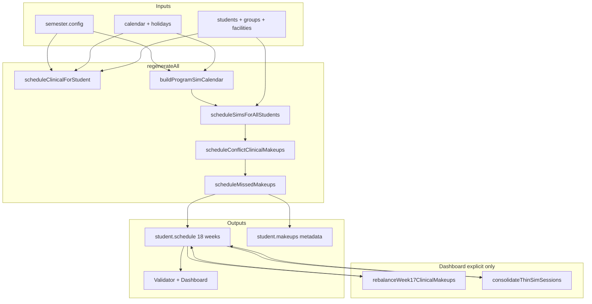

# Project implementation guide

This document summarizes the **Clinical & Simulation Management** app for engineers and agents implementing or extending behavior described in [`000_sim_clinical_tracker.md`](000_sim_clinical_tracker.md) (product scope) and [`docs/Design Docs/Scheduling_rules.md`](docs/Design%20Docs/Scheduling_rules.md) (scheduling contract). Design notes for end-of-semester makeup clustering and thin-sim consolidation: [`docs/Design Docs/week17_makeup_clustering_and_sim_soft_floor.md`](docs/Design%20Docs/week17_makeup_clustering_and_sim_soft_floor.md). For install, FERPA, and deployment, see [`README.md`](README.md).

---

## 1. What the app does

A **browser-only PWA** (no Microsoft API calls) that:

- Schedules up to **30 students** across **18 weeks** (including break/holiday weeks).
- Tracks **10 clinical days** and **5 simulation days** per student (configurable).
- Assigns students to **clinical groups** (fixed weekday + facility), **simulation groups** (alternating-week pattern), and **registrar sections** (independent of clinical/sim groups).
- Generates and validates schedules, supports **makeup** placement, **role assignments**, **performance flags**, printing, and JSON import/export via **OneDrive** or local files.

**Authoritative scheduling behavior** is defined in [`docs/Design Docs/Scheduling_rules.md`](docs/Design%20Docs/Scheduling_rules.md). Product features and layout are defined in [`000_sim_clinical_tracker.md`](000_sim_clinical_tracker.md). When code and docs disagree, align code to `Scheduling_rules.md` unless the product scope explicitly overrides.

---

## 2. Architecture (Vite + ES modules)

```
index.html → src/main.js
├── css/                         UI + print styles (imported by main.js)
├── src/
│   ├── core/state.js            Reactive state, getData/setData, notifyChange
│   ├── core/data-model/         Schema, defaults, migration, student/semester shapes
│   ├── core/scheduler/          Clinical + sim generation, makeup slots, Week-17 clustering, thin-sim post-pass
│   ├── core/scheduler/week17-*.js  Makeup clinical clustering (explicit Apply; not regenerateAll)
│   ├── core/scheduler/sim-thin-*.js  Soft-floor helpers + multi-pass thin consolidate (explicit button)
│   ├── core/calendar-engine.js  Public calendar barrel (weeks, holidays, block helpers)
│   ├── core/calendar-weeks.js   Sun–Sat week rebuild, date→week indexing
│   ├── core/calendar-holidays.js  break/holiday apply + isSchedulingBlockedWeek/Day
│   ├── core/scheduler/sim-block-weeks.js  Eligible-list per-day sim block allocation
│   ├── core/course-defaults.js  Per-course default config templates
│   ├── core/theory-data.js      Theory calendar schema, projections, contact-hour math
│   ├── storage/theory-library-storage.js  Theory library persistence + CRUD
│   ├── storage/theory-library-model.js    Pure theory shapes + migration
│   ├── storage/semester-storage.js        Semester persistence orchestration
│   ├── storage/semester-status-ui.js      Semester connection/status UI
│   ├── storage/storage-idb.js             Shared IndexedDB primitives
│   ├── auth/permissions.js      Tab/menu/action gating
│   ├── ui/chrome.js             Tab router, menus, semester switch
│   ├── ui/dialogs.js            Modal alert/confirm/custom dialogs
│   ├── ui/users-admin.js         Registry user administration
│   ├── ui/users-temp-credentials.js  Temp-password copy/text export UI
│   └── ui/                      Dashboard, setup, roles, makeup, audit, etc.
├── public/                      Icons + PWA manifest (copied to dist/)
└── tests/                       Vitest (imports from src/)
```

Each `src/**/*.js` module is capped at **500 lines** and starts with a brief header comment describing its purpose.

Storage modules keep their existing public entry points after splitting:
`semester-storage.js` re-exports shared IDB and status helpers, while
`theory-library-storage.js` re-exports the pure theory model API. This keeps
existing imports stable while isolating persistence, presentation, and model logic.

**Runtime model:** `state.fileRoot` holds all semesters; `getData()` returns the active semester. Simulation roles live in `meta.simRoles` (base64 obfuscated on disk) and are edited in memory via `state.simFacultyRoot`. UI modules call `notifyChange()` to persist the semester file.

**Boot order:** `UserSession.init()` → `semester-storage.init()` → `clinical-sites-library-storage.init()` → `theory-library-storage.init()` → `sim-faculty-storage.init()` → `initUI()`. Until the user session validates, `#userGateModal` blocks the app shell.

**Course shell:** `#courseStatusLine` dropdown sets `meta.activeCourseCode` (`REGN15` theory shell vs `REGN15P` clinical shell). Users and Clinical Sites open from the hamburger **Program libraries** menu.

**Local testing:** `npm test` runs Vitest. `node scripts/seed-mock-onedrive.js` creates gitignored `mock-onedrive/` fixtures. See [docs/MOCK_ONEDRIVE.md](docs/MOCK_ONEDRIVE.md).

**Role gating:** `Permissions.canTab()` / `canAction()` combined with `Audit.canEdit()` via `Permissions.guardEditable()`. Spec: [docs/Design Docs/User_roles_design.md](docs/Design%20Docs/User_roles_design.md).

---

## 3. Data files

| File | Typical name | Contents |
|------|----------------|----------|
| **User file** | `*.user.json` | userId, name, email, key (tamper deterrence) |
| **Users registry** | `users-registry.json` | Authoritative roles + key hashes |
| **Clinical sites library** | `clinical-sites-library.json` | Program-wide site catalog |
| **Playground** | `user_{token}_playground.json` | Isolated semester experiments |
| **Theory content library** | `theory-content-library_REGN15.json` | Topic bank (`moduleRef`, title) — no dates |
| **Semester file** | `{S\|F}{year}_{courseId}.json` (e.g. `F2026_REGN15P.json`); consolidated `F2026_REGN_program.json` for REGN15+15P; legacy `regn-tracker.json` | Roster, schedule, config, calendar, facilities, faculty, audit meta, **theory** (`semester.theory`), **proposals**, and **simulation roles** (`meta.simRoles`, base64 obfuscated) |
| **Audit PDF** | `{Season}-{Year}-{courseId}-Audit-v{n}.pdf` (e.g. `Fall-2026-REGN15P-Audit-v1.pdf`) | Signed end-of-semester audit record (official record after closeout) |

**Breaking change (fileVersion 4):** Separate `{token}_Faculty.json` files are no longer supported. Simulation role assignments must be stored in the semester file. Legacy plain `semester.roles` / `_legacySimRoles` embedded in old semester exports still migrate on load.

**Breaking change (fileVersion 5):** Adds `semester.theory` (REGN15 calendar data), `meta.activeCourseCode` (theory vs clinical shell), and optional consolidated program semester files. Theory is excluded from audit hash snapshots initially. Seed: `npm run seed:mock-onedrive` imports prototype docx via `npm run import:theory-prototypes`.

Course-aware names are suggested automatically when `meta.courseId` and semester season/year are set. Sim role edits remain allowed after audit export/lock — the audit lifecycle covers the semester file only.

### Semester file shape (simplified)

```json
{
  "meta": {
    "fileVersion": 5,
    "activeSemesterId": "…",
    "activeCourseCode": "REGN15P",
    "schedulingDefaults": { },
    "simRoles": { "encoding": "b64v1", "data": "…" }
  },
  "semesters": [{
    "id": "…",
    "meta": { "semesterName": "Spring 2026", "finalized": false },
    "config": { "clinicalDaysRequired": 10, "simDaysRequired": 5, "simDays": ["Mon","Tue"], … },
    "calendar": { "semesterStartDate": "2026-01-01", "weeks": [ ] },
    "theory": { "version": 1, "days": [ ], "settings": { } },
    "holidays": [ ],
    "facilities": [ ],
    "faculty": [ ],
    "sections": [ ],
    "students": [{
      "id": "…", "name": "…", "clinicalGroup": "C1", "simGroup": "SG1",
      "facilityId": "…", "section": "…",
      "schedule": [ /* 18 cells */ ],
      "absences": [ ], "makeups": [ ]
    }]
  }]
}
```

### Schedule cell (`js/data-model.js` → `emptyCell()`)

| Field | Meaning |
|-------|---------|
| `clinical` | Scheduled clinical that week |
| `clinicalMissed` | Clinical missed due to sim priority conflict |
| `sim` | Sim scenario number 1–5 |
| `simDay` | `Mon` / `Tue` (or other configured sim weekday) |
| `simGuestGroup` | Host sim group when attending as guest |
| `simOverload` | Joined session above normal cap |
| `simMakeup` | Sim placed as makeup (not initial generation) |
| `makeupClinical` | Makeup clinical day |
| `inactive` | Holiday/break week |
| `facilityId` | Optional clinical site for that week (multi-site groups) |

### Simulation roles in semester file

Keyed by `semesterId` → `studentId` → `{ flags: { primary, secondary }, "1": { iter1…iter4 }, … }`. Persisted as `meta.simRoles` (base64). See `src/auth/sim-faculty-data.js`.

---

## 4. Default domain model (configurable)

From `js/data-model.js` `defaultConfig()`:

| Concept | Default |
|---------|---------|
| Clinical groups | C1–C5 on Sat / Mon / Mon / Mon / Tue |
| Sim groups | SG1–SG4; primary weekday + even/odd pattern per group (`simGroupDays`, `simGroupPattern` in Setup) |
| Sim weekdays | Mon, Tue (program-wide `simDays` list) |
| Clinical start | Week 5 (Saturday for C1) |
| Sim start | Week 5 (program blocks); drives `getSimWeekPatterns()` |
| Caps | 6/clinical group (7 overload), 8/sim session (9 overload) — session cap is program-wide per weekday |
| Makeup headroom | `simMakeupHeadroomReserved: 1` (soft preference during initial gen) |
| Makeup target weeks | Optional `clinicalMakeupPrimaryWeek`, `clinicalMakeupFallbackWeek`, `simMakeupLastResortWeek`; blank = last active weeks via `CalendarEngine.resolveMakeupWeeks()` |
| Guest soft cap | `maxGuestSimsPerStudent` (default 1) |
| Makeup week clustering | `week17MakeupMode` (`current` \| `byAssignedDay` \| `byTargetDay` \| `byPreferredSite`), `week17MakeupTargetDay`, `week17MakeupPreferredSiteId` |

**Facilities:** Students attend clinical at the site assigned per week (`cell.facilityId`). Multi-site groups may use **round-robin** (default) or optional **`clinicalGroupSiteWeeks`** ranges (facility + start/end week index). `student.facilityId` holds the primary/home site.

**Sim group patterns** (`js/scheduler.js` → `getSimGroupSchedule()` reading semester config):

- Each sim group: primary weekday from `simGroupDays`, even/odd block weeks from `simGroupPattern` and `simStartWeek`
- Default SG1/SG2: even pattern; SG3/SG4: odd pattern (Mon/Tue respectively)
- When clinical and sim group **counts match**, `regenerateAll()` forces C*n*→SG*n* alignment

Program calendar builds **sim blocks** via `buildProgramSimCalendar()` → `buildProgramSimBlocks()`: for each `simDay`, collect eligible weeks from `simStartWeek` (skipping breaks and holiday blocks per `holidayBlocksFullWeek`), then assign even/odd slots by list position. Blocks store shared `evenWeekIndex`/`oddWeekIndex` when days agree, plus `weeksByDay[day]` when Mon/Tue streams diverge.

**Holidays:** Types are `break` (full week `inactive`) and `holiday` (date on any weekday; week stays editable for orientations). `config.holidayBlocksFullWeek` (course default: REGN15P/35P/48P true, REGN25P false) controls whether a holiday blocks the whole week or only that weekday for algo placement. Helpers: `isSchedulingBlockedWeek`, `isSchedulingBlockedDay`. Legacy `mondayHoliday` migrates to `holiday`.

**Week boundaries:** Week 1 = `semesterStartDate` through that Saturday; weeks 2–18 always Sunday–Saturday (`endDate` on each week).

**Example (F2026, week-block ON):** Veterans holiday in week 13 and Thanksgiving break in week 15 → eligible list skips those weeks → Sim 5 even week 14 / odd week 16 (Mon and Tue aligned). Tests: `tests/sim-holiday-push.test.js`, `tests/historic-semester-regen.test.js`.

---

## 5. Scheduling pipeline

`App.Scheduler.regenerateAll(data)` runs in order:

1. **Calendar** — `App.CalendarEngine.rebuildWeeks`; mark inactive weeks.
2. **Assignments** — sim groups (`roster-balance.js`; force C*n*→SG*n* when group counts match), facilities.
3. **Clear** schedules and sim makeup records.
4. **Program sim calendar** — `buildProgramSimCalendar` → `data._simCalendar` (block weeks per scenario).
5. **Clinical** — `scheduleClinicalForStudent` per student from `clinicalStartWeek` on group weekday.
6. **Simulations** — `scheduleSimsForAllStudents` with placement tiers (below).
7. **Conflict makeups** — clinical missed for sim → primary/fallback makeup weeks (`resolveMakeupWeeks`); same facility.
8. **Other makeups** — `scheduleMissedMakeups` for absence-driven gaps.

**Not part of `regenerateAll`:** Week-17 makeup clinical **clustering** and **thin-sim consolidation** are explicit Dashboard actions only (see §5.1). Regenerating with a non-`current` clustering mode sets `_week17ClusteringStale` so faculty know to re-apply.

Single-student regen: `regenerateStudent()` clears that student’s sims and re-runs sim + makeup steps.

### Sim placement priority (`Scheduling_rules.md` → `buildSimPlacementCandidates` / `tryPlaceSim`)

1. Primary pattern week + weekday for student’s sim group  
2. Alternate sim weekday in same block week  
3. Alternate week in same program block  
4. **Guest** in another sim group (prefer lighter sessions)  
5. **Overload** join (only when normal/headroom exhausted; flagged `simOverload`)  
6. **Week 18** last resort (only after calendar exhausted for that scenario)

**Session load balancing** (same tier tie-breaks):

- **A** — Prefer lowest attendance for that scenario on `(week, day)`.
- **B** — Guest slots sorted ascending by session count.
- **C** — Soft headroom: defer overload while block has capacity below `normal - simMakeupHeadroomReserved`; may still fill to normal cap to place all students.
- **D** — If clinical weekday ∈ `simDays`, route to non-overlapping sim day when no same-week clinical conflict.
- **E (soft floor, home seats only)** — During placement scoring, prefer joining an already-open **thin** session (below `⌊max/2⌋`) over opening an empty day when both candidates are home (non-guest) seats. Among open sessions still prefer lower load; empty still beats already-healthy. Implemented in `candidateLoadScoreSoftFloor` / `compareCandidatesByLoad` (`helpers.js`). Does not guarantee every remnant session reaches half capacity.

**Conflict rules:** Sim wins over clinical on same weekday; at most **one** sim/clinical weekday conflict per student per semester; conflict makeup clinical is tier “conflict” (orange in UI). **One simulation scenario per week+day** (all attendees on that Monday/Tuesday share the same `sim` number) — see `Scheduling_rules.md`.

### Makeup finder (`findMakeupSlots` / `applyMakeupSlot`)

- **Sim makeup:** Join existing session with same scenario number (weeks 1–17); overload only when session at normal cap.
- **Clinical makeup:** Join existing clinical at student’s facility when possible; week 18 last resort.
- Manual makeup does **not** apply headroom reserve.

### 5.1 Explicit makeup-week clustering and thin-sim post-pass

Design and acceptance scenarios: [`docs/Design Docs/week17_makeup_clustering_and_sim_soft_floor.md`](docs/Design%20Docs/week17_makeup_clustering_and_sim_soft_floor.md).

#### Phase 1 — Makeup clinical clustering (resolved primary week)

**Goal:** Minimize faculty makeup **clinical groups** in the clinical makeup primary week (often week 17 via `resolveMakeupWeeks().clinicalPrimary`), with even splits under `maxPerClinicalGroup`.

| Mode (`week17MakeupMode`) | Behavior |
|---------------------------|----------|
| `current` | Leave makeup clinicals as placed by the normal conflict/makeup pipeline |
| `byAssignedDay` | Pack onto each student’s usual clinical weekday at their assigned site |
| `byTargetDay` | Shared target weekday (`week17MakeupTargetDay`); site lock still wins |
| `byPreferredSite` | Pack at `week17MakeupPreferredSiteId`; may **transfer** blocking sim-on-clinical conflicts from non-preferred donors onto preferred-site recipients so makeup demand concentrates at the preferred site |

**Hard constraints:** site lock, preserve `clinicalGroup`, one makeup clinical in the target week per student, clinical session max, calendar eligibility, ordered sims (no duplicates / extras / missing).

**Apply path:** Dashboard **Apply makeup week rebalance** → `Scheduler.rebalanceWeek17ClinicalMakeups` (`week17-clinical-makeup.js`, conflict transfer in `week17-conflict-transfer.js`). Preview/ranking: `week17-makeup-preview.js`. UI: `src/ui/dashboard/week17-makeup-ui.js`.

**Tests:** `tests/week17-clinical-makeup.test.js`, `tests/week17-preferred-site-pack.test.js`.

#### Phase 2 / 2.5 — Sim soft floor + multi-pass thin consolidate

**During regen (Phase 2 scoring):** gentler soft floor among home seats (see load balancing **E** above).

**Explicit button — Consolidate thin sim sessions:** `Scheduler.consolidateThinSimSessions` clones the baseline and compares five candidates, then applies the winner:

| Candidate | Behavior |
|-----------|----------|
| `baseline` | No moves |
| `evacuate` | Move students out of sessions below the **absolute** floor into denser same-scenario open seats; also relocates **minority** students on mixed-scenario days |
| `fill` | Pull donors into under-**ideal** open sessions without dropping the donor session below absolute |
| `evacuateThenFill` / `fillThenEvacuate` | Sequenced passes |

**Floors:** absolute = `getSimPracticalMinLoad` → `⌊maxStudentsPerSimSession / 2⌋`; ideal = `getSimIdealMinLoad` → `max(absolute, ⌈0.75 · max⌉)`.

**Ranking:** fewest under-absolute sessions → fewest under-ideal → absolute deficit → fewer moves → prefer `baseline`.

**Move integrity (anti-§5):** same `sim` number kept; progression window between neighbor sims; guest soft cap; clinical count unchanged; at most one clinical–sim conflict; **destination week+day must not already host a different scenario**; rollback on failure. Modules: `sim-thin-shared.js`, `sim-thin-evacuate.js`, `sim-thin-fill.js`, `sim-thin-consolidate.js`.

**Tests:** `tests/sim-load-soft-floor.test.js`.

---

## 6. Validation and feasibility

| Module | When | Purpose |
|--------|------|---------|
| `js/feasibility.js` | Setup / config change | Pre-check: roster vs caps, slot counts, holidays, headroom config |
| `js/schedule-status.js` | Setup panel | Post-generation tier: green / yellow / red |
| `js/validator.js` | Dashboard render | Per-student counts, sim order, double-booking, session caps, conflict makeup rules |

**Setup schedule status tiers** (`js/schedule-status.js`):

| Tier | Meaning |
|------|---------|
| Green | All students meet clinical + sim requirements; no substitutions or makeups |
| Yellow | All students complete; substitutions (non-primary sim, guest, overload) and/or makeups used |
| Red | Students incomplete after generation, or blocking pre-generation config issues |

Clinical/sim weekday overlap is **informational** in `feasibility.js` (not a generation failure when schedules complete).

Tests in `tests/scheduling-rules.test.js` assert program calendar, guest spread, week-18 defer, load balance, headroom, and overlap routing against `Scheduling_rules.md`. `tests/schedule-status.test.js` covers the setup tiers. `tests/sim-holiday-push.test.js` covers Sun–Sat weeks, Fall 2025 week-block ON/OFF, and F2026 Sim5 push. `tests/historic-semester-regen.test.js` regenerates from S2026 (4×4) and F2026 (5×4) advanced configs. Week-17 clustering: `tests/week17-clinical-makeup.test.js`, `tests/week17-preferred-site-pack.test.js`. Soft floor / thin consolidate: `tests/sim-load-soft-floor.test.js`.

---

## 7. UI map (`000_sim_clinical_tracker.md` → code)

| Feature | Tab / area | Module |
|---------|------------|--------|
| Master calendar + filters | Dashboard | `js/ui/dashboard.js` |
| Sim progression table (guest cells highlighted) | Dashboard | `dashboard.js` → `renderSimTable` |
| Makeup week clinical clustering + thin sim consolidate | Dashboard summary actions panel | `src/ui/dashboard/week17-makeup-ui.js` |
| Student calendar + print | Student View | `js/ui/student-view.js` |
| Simulation roles + flags | Simulation Roles | `src/ui/sim-roles.js` + `src/storage/sim-faculty-storage.js` |
| Makeup search | Makeup Finder | `js/ui/makeup-finder.js` |
| Audit lifecycle, attestation, audit PDF | Audit | `js/ui/audit-closeout.js`, `js/audit.js`, `js/audit-export.js` |
| Roster, holidays, facilities, rebalance | Setup | `src/ui/setup/roster.js`, `setup-config.js` |
| Advanced caps / days / headroom / site library | Setup → Advanced | `js/ui/setup-config.js` |
| Course selection | Header dropdown | `js/main.js`, `js/course-defaults.js` |
| Semester add/switch | Header picker | `js/main.js`, `js/ui/config-modal.js` |
| Dark mode | Menu | `App.UI.toggleDarkMode` |

**Setup roster actions:** **Rebalance clinical groups** evenly spreads students across clinical cohorts only. **Rebalance simulation groups** balances sim group sizes to the session cap (preferring clinical-cohort affinity and non-overlapping sim weekdays), regenerates with a per-student guest soft cap (`maxGuestSimsPerStudent`, default 1), and nudges membership up to 5 passes. Warns if the soft cap cannot be met (e.g. more Mon-clinical students than Tue sim seats). Playground Setup uses the same controls (cloned markup); only the save target differs (`playground.json` vs semester program file).

**Dashboard makeup panel:** Toggle **Makeup clinicals week N** (label uses resolved clinical makeup primary week). Choose clustering mode (+ target day / preferred site), then **Apply makeup week rebalance**. Separately, **Consolidate thin sim sessions** runs the multi-pass evacuate/fill comparer (§5.1) and reports the winning candidate and under-absolute / under-ideal counts. Neither action runs inside `regenerateAll`.

**Sim Roles tab** requires a connected semester file. Role edits save into `meta.simRoles` on the semester file (base64 obfuscated in JSON exports).

---

## 8. Configuration contract

From `000_sim_clinical_tracker.md` **Scheduling adjustment configuration**:

- `clinicalDaysRequired`, `simDaysRequired`
- `clinicalGroups`, `clinicalGroupDays`, `simGroups`, `simDays`
- `maxStudents`, `maxPerClinicalGroup`, `maxStudentsPerSimSession`, overload caps
- `clinicalStartWeek`, `simStartWeek`
- `simMakeupHeadroomReserved`
- `maxGuestSimsPerStudent`
- `week17MakeupMode`, `week17MakeupTargetDay`, `week17MakeupPreferredSiteId`

**Requirement:** Changing config must still allow placing all students for the new required day counts (`feasibility.js` + `regenerateAll`). Setup shows warnings when generation is likely impossible.

---

## 9. Testing

```bash
npm test                              # Vitest full suite
npm test -- tests/scheduling-rules.test.js
npm test -- tests/week17-clinical-makeup.test.js
npm test -- tests/week17-preferred-site-pack.test.js
npm test -- tests/sim-load-soft-floor.test.js
npm run check:line-limit              # src/**/*.js ≤ 500 lines
```

Harness: `tests/_harness.js` loads app modules for Node. Fixture-backed tests may read gitignored `mock-onedrive/semesters/*.json` (skipped when absent).

---

## 10. Implementation checklist for agents

When changing scheduling behavior:

1. Read [`docs/Design Docs/Scheduling_rules.md`](docs/Design%20Docs/Scheduling_rules.md) for the intended rule.
2. Implement in `src/core/scheduler/` (placement, makeups, calendar, week17 / thin-sim post-passes).
3. Mirror constraints in the validator if user-visible.
4. Add pre-checks to feasibility if config-dependent.
5. Add assertions to the relevant Vitest file (`scheduling-rules`, `week17-*`, `sim-load-soft-floor`).
6. Keep rules **config-agnostic** in `Scheduling_rules.md` (no hardcoded “C2 → Tuesday”).
7. **Never** call makeup-week clustering or thin-sim consolidate from `regenerateAll` unless product explicitly changes that contract.
8. Preserve sim/clinical integrity: no duplicate sims, no extra/missing sims, required clinical days, one scenario per week+day.

When changing Week-17 / thin-sim behavior:

- Design notes: [`docs/Design Docs/week17_makeup_clustering_and_sim_soft_floor.md`](docs/Design%20Docs/week17_makeup_clustering_and_sim_soft_floor.md).
- UI wiring: `src/ui/dashboard/week17-makeup-ui.js` + Dashboard panel in `index.html`.

When changing data shape:

- Bump / migrate in `src/core/data-model/` (`migrateFile`, `migrateSemester`).
- Semester export must **never** include `roles` (`storage.js` → `serialize` + `SimFacultyData.cloneFileRootWithoutRoles`).

When changing sim faculty data:

- `src/auth/sim-faculty-data.js` (schema), `src/storage/sim-faculty-storage.js` (persistence), `src/ui/sim-roles.js` (UI).

**Do not** commit real student JSON to git (see `README.md` FERPA section and `.cursor/rules/no-student-data-commit.mdc`).

When implementing audit / closeout:

- Read [docs/AUDIT_TRACKING_IMPLEMENTATION.md](docs/AUDIT_TRACKING_IMPLEMENTATION.md) for schema, UI, and phases.
- Process SOP for staff: [docs/AUDIT_TRACKING_OPERATIONS.md](docs/AUDIT_TRACKING_OPERATIONS.md).
- Workflow diagram: [audit_tracking_workflow.md](audit_tracking_workflow.md).

---

## 11. Related files

| Document | Role |
|----------|------|
| [`000_sim_clinical_tracker.md`](000_sim_clinical_tracker.md) | Product scope, features, layout |
| [`docs/Design Docs/Scheduling_rules.md`](docs/Design%20Docs/Scheduling_rules.md) | Scheduling algorithm contract |
| [`docs/Design Docs/week17_makeup_clustering_and_sim_soft_floor.md`](docs/Design%20Docs/week17_makeup_clustering_and_sim_soft_floor.md) | Makeup clustering + soft floor + multi-pass thin consolidate |
| [`README.md`](README.md) | Install, OneDrive workflow, Pages deploy |
| [`TODO.md`](TODO.md) | Maintainer task list |
| [`audit_tracking_workflow.md`](audit_tracking_workflow.md) | Audit closeout process diagram |
| [`docs/AUDIT_TRACKING_IMPLEMENTATION.md`](docs/AUDIT_TRACKING_IMPLEMENTATION.md) | Audit feature technical spec |
| [`docs/AUDIT_TRACKING_OPERATIONS.md`](docs/AUDIT_TRACKING_OPERATIONS.md) | Audit closeout SOP for staff |

---

## 12. High-level scheduling flow (diagram)


```mermaid
flowchart TD
  subgraph inputs [Inputs]
    Config[semester.config]
    Calendar[calendar + holidays]
    Roster[students + groups + facilities]
  end

  subgraph gen [regenerateAll]
    Clin[scheduleClinicalForStudent]
    ProgCal[buildProgramSimCalendar]
    Sims[scheduleSimsForAllStudents]
    ConflictMU[scheduleConflictClinicalMakeups]
    OtherMU[scheduleMissedMakeups]
  end

  subgraph explicit [Dashboard explicit only]
    W17[rebalanceWeek17ClinicalMakeups]
    Thin[consolidateThinSimSessions]
  end

  subgraph outputs [Outputs]
    Schedule[student.schedule 18 weeks]
    Makeups[student.makeups metadata]
    Validate[Validator + Dashboard]
  end

  Config --> Clin
  Calendar --> Clin
  Roster --> Clin
  Config --> ProgCal
  Calendar --> ProgCal
  ProgCal --> Sims
  Roster --> Sims
  Sims --> ConflictMU
  ConflictMU --> OtherMU
  OtherMU --> Schedule
  OtherMU --> Makeups
  Schedule --> Validate
  Schedule --> W17
  W17 --> Schedule
  Schedule --> Thin
  Thin --> Schedule
```

This guide is the entry point for understanding **what** the project implements and **where** the logic lives relative to the specification documents.
