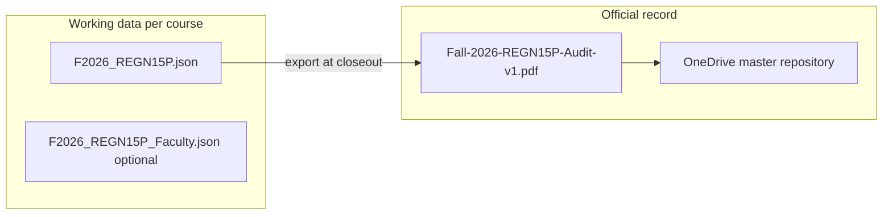
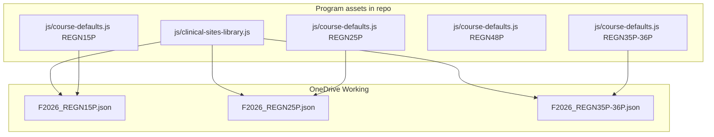
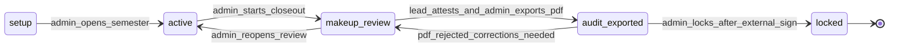

# Audit tracking — implementation guide

Technical specification for implementing the end-of-semester audit and closeout workflow described in [audit_tracking_workflow.md](../audit_tracking_workflow.md).

**Audience:** Developers and coding agents.

**Operations guide (non-technical):** [AUDIT_TRACKING_OPERATIONS.md](AUDIT_TRACKING_OPERATIONS.md)

---

## 1. Design principles

| Principle | Detail |
|-----------|--------|
| **No MSAL / Graph / Power Platform** | Identity at closeout is established by **externally digitally signed PDFs**, not in-app login. |
| **System of record** | During the semester: `{semesterYear}_{courseId}.json` on OneDrive (e.g. `F2026_REGN15P.json`). After closeout: **signed audit PDF** in the master repository folder. |
| **In-app attestation** | Workflow gate only (typed name + timestamp). Not cryptographic proof. |
| **Lead faculty vs clinical faculty** | **Lead course faculty** attests all makeup records at closeout. **Clinical group faculty** (`semester.faculty[]`) remain per-group liaisons for operational contact. |
| **FERPA** | Same data policy as [README.md](../README.md) — real student data never in GitHub. |
| **Multi-course** | One working file per `{semesterYear}_{courseId}`; REGN35P and REGN36P share `REGN35P-36P`. Clinical sites from a shared program library. |



---

## 2. Multi-course program scope

The app currently targets a single REGN 15P cohort. **Planned expansion** supports multiple nursing courses in the same program, each with its own semester working file, optional faculty file, and course-specific default configuration. **Clinical sites are shared** across courses via a program-wide site library.

### 2.1 Supported courses

| `courseId` | Description | Semester file |
|------------|-------------|---------------|
| `REGN15P` | First-semester clinical & simulation | One file per term |
| `REGN25P` | Second-semester clinical & simulation | One file per term |
| `REGN35P-36P` | Two half-semester clinical courses (**REGN35P** and **REGN36P**) that share clinical groups and scheduling | **One shared file** per term |
| `REGN48P` | Fourth-semester clinical & simulation | One file per term | Practicum Placement (will need additional student assignment logic at later date)

**REGN35P-36P rule:** Both course numbers map to the same `courseId` value `REGN35P-36P`. One working JSON holds roster, groups, and schedule for the combined half-semester clinical block. Audit closeout and attestation apply to that shared file once per term (not per half-course number).

### 2.2 OneDrive file naming

| File | Pattern | Example |
|------|---------|---------|
| **Semester (working)** | `{semesterYear}_{courseId}.json` | `F2026_REGN15P.json` |
| **Sim faculty (optional)** | `{semesterYear}_{courseId}_Faculty.json` | `F2026_REGN15P_Faculty.json` |
| **Audit PDF (unsigned / signed)** | `{Season}-{Year}-{courseId}-Audit-v{n}.pdf` | `Fall-2026-REGN15P-Audit-v1.pdf` |

**`semesterYear` token:** season letter + four-digit year — `F2026`, `S2026`, etc. (align with existing `meta.semesterSeason` + `meta.semesterYear` in Setup).

**Legacy names:** `regn-tracker.json` and `regn-tracker-sim-faculty.json` remain valid for migration; new semesters should use the schema above. Storage layer should suggest the new name on export/save when `courseId` and semester year are known.

### 2.3 Course default configuration

Each supported course has a **default configuration template** (program engineer maintained). Used when admin creates a new semester for that course.

> **Implemented as a JS data module, not repo JSON:** this repo blocks committing `.json` files (pre-commit hook + workspace rule) and `sw.js` bypasses cache for `.json` requests (breaking offline PWA use). All four course templates therefore live in **`js/course-defaults.js`** (`App.CourseDefaults`) as `configOverrides` deltas merged over `defaultConfig()` at lookup time.

| Source (implemented) | Contents |
|------------------|----------|
| `js/course-defaults.js` — `REGN15P` entry | Default `config` (current program defaults), content areas |
| `js/course-defaults.js` — `REGN25P` entry | Same shape, course-specific values (placeholder for engineer tuning) |
| `js/course-defaults.js` — `REGN35P-36P` entry | Shared defaults for the combined half-semester clinical block |
| `js/course-defaults.js` — `REGN48P` entry | Same shape; practicum placement logic deferred |

Today [`js/data-model.js`](../js/data-model.js) `defaultConfig()` is 15P-specific. Multi-course work adds:

- `meta.courseId` on each semester (and file root if single-semester files)
- Loader that merges course template → new semester on create
- Setup UI: course picker when creating semester (admin)

**Per-course defaults may differ:** clinical/sim day counts, group counts, start weeks, required content areas (hour requirements), orientation patterns, etc. **Site specialty tags** (`MS`, `OB`, `PEDS`, `MH`) live on the shared clinical site library — see §2.4. **Facilities list is not duplicated per course** — see §2.4.

### 2.4 Clinical site library (shared)

Clinical facility **names** are shared across all courses. Introduce a program-wide **clinical site library** instead of embedding full site catalogs in each semester file or each course default.

**Purpose:** One canonical list of site `name`, `shortName`, and **specialty content tags** for dropdowns, exports, makeup placement, and cross-course consistency.

**Content tags (per site):** Each site tracks which clinical specialty areas it supports. Allowed values:

| Tag | Meaning |
|-----|---------|
| `MS` | Medical-surgical (default when tag omitted — backward compatibility) |
| `OB` | Obstetrics |
| `PEDS` | Pediatrics |
| `MH` | Mental health |

A site may have **one or more** tags (e.g. a hospital with both MS and OB units). Migration and load: if `contentTags` is missing or empty → `["MS"]`.

**Implemented module:** `js/clinical-sites-library.js` (`App.SiteLibrary`) — separate from the existing `js/clinical-sites.js` (per-group runtime site resolution).
**Data location:** the built-in seed lives in the JS module itself (repo asset, no student data — same `.json` restrictions as §2.3). **In-app edits** made in the Advanced Configuration site library editor are persisted as a full copy in `fileRoot.meta.siteLibrary`, which travels with the OneDrive semester file and takes precedence over the seed. Shape of the persisted copy:

```javascript
{
  "meta": { "version": 1 },
  "sites": [
    {
      "id": "site_srmc",
      "name": "Shasta Regional Medical Center",
      "shortName": "SRMC",
      "contentTags": ["MS", "OB"]
    },
    {
      "id": "site_stel",
      "name": "Saint Elizabeth",
      "shortName": "StE",
      "contentTags": ["MS"]
    }
  ]
}
```

| Concern | Approach |
|---------|----------|
| **Storage** | Library in repo (site names + tags only, no FERPA). Semester file stores `siteId` references. |
| **Semester `facilities[]`** | Resolved from library on load, or subset copied at semester create with stable ids and tags |
| **UI** | Setup → Facilities reads from library; `shortName` for compact labels; **content tag multi-select** per site |
| **Migration** | Existing semester `facilities[{ id, name }]` matched to library by normalized name; add `shortName` and default `contentTags: ["MS"]` where missing |
| **Course defaults** | Reference site ids from library, not inline facility names |
| **Makeup / scheduling** | Filter or warn when assigning makeup to a site whose tags do not match required content area (future) |

**Distinction:** **Clinical site library** = program catalog (`name`, `shortName`, `contentTags`). **Semester `facilities[]`** = sites in use for that term (may be a subset; ids and tags copied from library).

### 2.5 Multi-course workflow impact

| Area | Change |
|------|--------|
| File open / save | Suggest `{semesterYear}_{courseId}.json`; validate `courseId` matches filename |
| New semester | Select course → load course default → attach sites from library |
| Audit PDF | Cover and filename include `courseId` / course display name |
| Snapshot hash | Include `courseId` in canonical payload |
| Sim faculty file | `{semesterYear}_{courseId}_Faculty.json` paired with semester file |
| OneDrive layout | Working folder holds multiple course files per term (e.g. `F2026_REGN15P.json`, `F2026_REGN25P.json`) |



---

## 3. Workflow mapping

### Setup phase

| Step | Actor | Implementation |
|------|-------|----------------|
| Course template | Program engineer | Per-course entries in [`js/course-defaults.js`](../js/course-defaults.js) + shared [`js/clinical-sites-library.js`](../js/clinical-sites-library.js) |
| New semester | Admin | Existing Setup tab; **select course** → load course default + site library |
| Faculty preview / suggestions | Clinical faculty | **Process only** — email to admin |
| Open semester for teaching | Admin | Set `auditPhase` to `active` |
| Set lead faculty | Admin | **New** `meta.leadFaculty` fields in Setup |

### During semester

| Step | Actor | Implementation |
|------|-------|----------------|
| Makeup assignment | Clinical faculty | Existing Makeup Finder → [`js/scheduler.js`](../js/scheduler.js) `applyMakeupSlot()` → `student.makeups[]` |

### End of semester

| Step | Actor | Implementation |
|------|-------|----------------|
| Review makeups | Lead faculty | **New** Audit / Closeout UI |
| Attest makeups correct | Lead faculty | **New** `meta.makeupAttestation` |
| Export audit PDF | Admin | **New** `js/audit-export.js` |
| Review PDF | Lead faculty | **Process** — email |
| Digitally sign PDF | Lead faculty + admin | **Process** — Adobe / college e-sign |
| Save to repository | Admin | **Process** — OneDrive folder |
| Lock semester | Admin | **New** `auditPhase = locked` + read-only app mode |

---

## 4. Data model

### 4.1 Semester `meta` extensions

Add to `semester.meta` in [`js/data-model.js`](../js/data-model.js). Migrate in `migrateSemester()` with safe defaults for existing files.

```javascript
{
  // Course identifier — REGN15P | REGN25P | REGN35P-36P | REGN48P
  courseId: "",

  // Lifecycle — see §5
  auditPhase: "setup",  // setup | active | makeup_review | audit_exported | locked

  // Lead course faculty (one person for the cohort; NOT semester.faculty[] entries)
  leadFaculty: {
    name: "",
    email: ""
  },

  // Lead faculty attestation before admin exports audit PDF
  makeupAttestation: {
    attestedAt: null,       // ISO-8601 string or null
    attestedByName: "",
    attestedByEmail: "",
    notes: ""
  },

  // Admin audit export metadata
  auditExport: {
    exportedAt: null,
    exportedByName: "",
    snapshotHash: "",       // SHA-256 hex of canonical payload — see §4.4
    appVersion: "",
    exportVersion: 0        // increment on each re-export (v1, v2, …)
  },

  lock: {
    lockedAt: null,
    lockedByName: "",
    lockedReason: "semester_complete"
  },

  // Legacy — map to auditPhase on load; do not remove yet
  finalized: false
}
```

**Faculty distinction:**

| Field | Meaning |
|-------|---------|
| `semester.faculty[]` | One row per **clinical group** (C1–C5); `name` + `clinicalGroup`. Existing `syncSemesterFaculty()`. |
| `semester.meta.leadFaculty` | **Lead course faculty** — attests makeup closeout for the entire semester. |

### 4.2 Clinical site library shape (program-wide)

Separate from semester file. Loaded at app boot or on demand.

**Allowed `contentTags` values:** `OB`, `PEDS`, `MH`, `MS` (obstetrics, pediatrics, mental health, medical-surgical). **Default:** `["MS"]` when absent — backward compatibility for existing facilities and library entries without tags.

```javascript
{
  meta: { version: 1 },
  sites: [
    {
      id: "site_…",
      name: "Full legal / display name",
      shortName: "SRMC",
      contentTags: ["MS", "OB"]   // one or more; omit → treated as ["MS"] on load
    }
  ]
}
```

**Normalization (on load / migrate):**

1. Coerce missing or empty `contentTags` → `["MS"]`.
2. Drop unknown tag strings; if result is empty → `["MS"]`.
3. De-duplicate and sort tags in stable order: `MS`, `OB`, `PEDS`, `MH`.

Semester `facilities[]` entries reference library sites:

```javascript
{
  id: "site_…",
  siteId: "site_…",
  name: "…",
  shortName: "…",
  contentTags: ["MS"]   // copied from library; same default rules apply
}
```

During migration, facilities with only `{ id, name }` are matched to library entries by normalized name. `shortName` is required for new sites in the library; optional on semester copies for backward compatibility. **`contentTags` defaults to `["MS"]`** when not present on library or semester copies.

**Future use:** Makeup Finder and validators may filter sites by tag when a student needs a specific content area; audit PDF makeup log may show site tags alongside `shortName`.

### 4.3 Makeup record extensions (Phase 5 — optional)

Current entries from `applyMakeupSlot()` lack provenance. Phase 1 audit export derives rows from existing `makeups[]` + schedule cells.

Phase 5 addition on each new makeup:

```javascript
{
  id: "uuid",
  appliedAt: "ISO-8601",
  appliedByName: "",
  // existing: weekIndex, type, facilityId, joinedDay, hostGroup, overload,
  //           week18Fallback, simNum, clinicalConflict, …
}
```

### 4.4 Canonical snapshot hash

Used for `meta.auditExport.snapshotHash` and PDF footer.

**Module (future):** `js/audit-snapshot.js`

**Algorithm:**

1. Deep-clone the active semester object.
2. Remove volatile / non-audit fields: `meta.lastModified`, file-root `meta`, UI caches (`_simCalendar`, etc.).
3. Sort `students` by `name` (localeCompare).
4. For each student, sort `makeups` by `weekIndex`, then `type`.
5. Build payload object:
   ```javascript
   {
     semesterId: semester.id,
     courseId: semester.meta.courseId,
     semesterName: semester.meta.semesterName,
     config: { clinicalDaysRequired, simDaysRequired },
     students: [ { id, name, clinicalGroup, schedule, makeups, absences } ],
     makeupAttestation: semester.meta.makeupAttestation,
     leadFaculty: semester.meta.leadFaculty
   }
   ```
6. `JSON.stringify(payload)` with stable key order (build object in fixed order; no pretty-print).
7. `crypto.subtle.digest('SHA-256', …)` → lowercase hex string.

**Migration:** Existing semesters get `auditPhase: "active"` if `finalized === true` was set at semester open, or infer from context; document mapping in `migrateSemester`:

| Legacy | New |
|--------|-----|
| `finalized: true` (semester open flag only) | `auditPhase: "active"` |
| No audit fields | `auditPhase: "setup"` until admin opens semester |

Do **not** auto-lock from legacy `finalized`.

---

## 5. Semester lifecycle (`auditPhase`)



### Phase transition rules

| Transition | Who | Preconditions |
|------------|-----|----------------|
| `setup` → `active` | Admin | Lead faculty name set; semester configured |
| `active` → `makeup_review` | Admin | Confirm dialog |
| `makeup_review` → `active` | Admin | Clears attestation optional (confirm) |
| `makeup_review` → `audit_exported` | Admin | `makeupAttestation.attestedAt` set; PDF exported |
| `audit_exported` → `makeup_review` | Admin | Corrections needed; increment export version on next export |
| `audit_exported` → `locked` | Admin | Confirm external signing complete per SOP |
| Any → `locked` | — | Irreversible in app (admin may only unlock via explicit future feature + confirm) |

### UI gating by phase

| Phase | Setup edits | Regenerate | Makeup Finder | Master cell edit | Audit tab | Export audit PDF | Lock |
|-------|-------------|------------|---------------|------------------|-----------|------------------|------|
| `setup` | Yes | Yes | Yes | Yes | Hidden | No | No |
| `active` | Yes | Yes | Yes | Yes | Hidden | No | No |
| `makeup_review` | Yes | Yes | Yes | Yes | Yes | After attestation | No |
| `audit_exported` | No | No | No | No | View | Re-export (new version) | Yes |
| `locked` | No | No | No | No | View | No | — |

Implement gating via **`App.Audit.isLocked(semester)`** and **`App.Audit.canEdit(semester, action)`** (future module) called from `notifyChange`, Setup, Makeup Finder, and master calendar.

---

## 6. UI specification

### 6.1 Setup — lead faculty

**Location:** Setup → Semester card, subsection **Course staff** (below season/year or near finalize).

| Field | Required | Storage |
|-------|----------|---------|
| Lead faculty name | Before closeout | `meta.leadFaculty.name` |
| Lead faculty email | Optional | `meta.leadFaculty.email` |

**Validation:** Block **Start makeup review** if `leadFaculty.name` is empty.

### 6.2 Audit / Closeout tab

**Placement:** New nav tab `#view-audit` / `data-tab="audit"`.

**Visibility:** Show when `auditPhase !== 'setup'` OR always visible with empty state (“Semester not yet active for audit”).

**Module (future):** `js/ui/audit-closeout.js`

#### Lead faculty section (`makeup_review` and later)

- Read-only **makeup summary table**: student, clinical group, week, type, details (reuse makeup tier / join labels from [`js/makeup-display.js`](../js/makeup-display.js)).
- Filter by clinical group.
- **Attestation form:**
  - Checkbox: “I attest that makeup and absence records for this semester are correct.”
  - Name (default `leadFaculty.name`), email (optional), notes (optional).
  - Button **Submit attestation** → sets `makeupAttestation`, `notifyChange()`.
- Read-only after attestation unless admin reopens review.

#### Admin section

| Control | Action |
|---------|--------|
| **Open semester for teaching** | `auditPhase = active` (from `setup`) |
| **Start makeup review** | `auditPhase = makeup_review` |
| **Reopen for corrections** | `auditPhase = active` or `makeup_review`; optional clear attestation |
| **Export audit PDF** | Enabled when attestation present; runs export + sets `audit_exported` |
| **Lock semester** | Enabled after export; sets `locked`; read-only mode |

Use existing [`App.UI.showConfirm`](../js/main.js) / `showAlert` for confirmations.

### 6.3 Read-only mode (`audit_exported`, `locked`)

When locked or exported-pending-sign:

- Disable Setup save, regenerate, roster edits, makeup apply, master cell editor.
- Allow Dashboard / Student View / print / Excel export (reference only).
- Show banner: “Semester in closeout — editing disabled.”

---

## 7. Audit PDF export

**Module (future):** `js/audit-export.js`  
**Styles (future):** `css/audit-print.css`  
**Separate from:** [`js/dashboard-export.js`](../js/dashboard-export.js) (Excel schedule reference).

### 7.1 Generation approach

| Version | Method | Notes |
|---------|--------|-------|
| **v1 (recommended)** | Hidden print DOM + `css/audit-print.css` + `window.print()` → Save as PDF | No new vendor; works on GitHub Pages |
| **v2 (optional)** | `pdf-lib` in `vendor/` | Programmatic footer hash; evaluate bundle size |

### 7.2 PDF content sections

1. **Cover** — Course id (`courseId`), semester name, start date, lead faculty, export timestamp, export version, snapshot hash (SHA-256), disclaimer.
2. **Requirements summary** — Per student: clinical days required vs completed, sim days required vs completed (reuse validator counting logic from [`js/validator.js`](../js/validator.js)).
3. **Makeup log** — Columns: Student, Group, Week, Type (clinical/sim), Facility/site (`shortName`, **content tags** when available), Join day, Overload, Week-18 fallback, Conflict flags.
4. **Attestation** — Lead faculty name, email, attestedAt, notes from `makeupAttestation`.
5. **Signature blocks (informational)** — Printed lines for lead faculty and admin; actual digital signatures applied **outside** the app.
6. **Footer** — App version constant, hash, text: *“Uncontrolled copy if not digitally signed per program SOP.”*

### 7.3 Filename

`{Season}-{Year}-{courseId}-Audit-v{n}.pdf` — e.g. `Fall-2026-REGN15P-Audit-v1.pdf`. See [AUDIT_TRACKING_OPERATIONS.md](AUDIT_TRACKING_OPERATIONS.md).

### 7.4 Export side effects

On successful export:

```javascript
semester.meta.auditPhase = 'audit_exported';
semester.meta.auditExport = {
  exportedAt: new Date().toISOString(),
  exportedByName: adminTypedName,  // prompt or session display name
  snapshotHash: hash,
  appVersion: AUDIT_APP_VERSION,
  exportVersion: (prev.exportVersion || 0) + 1
};
App.notifyChange();
```

---

## 8. Codebase touchpoints

| Area | File | Change |
|------|------|--------|
| Course defaults | `js/course-defaults.js` (new) | Per-course default config templates (JS module — see §2.3) |
| Clinical site library | `js/clinical-sites-library.js` (new) | Shared site `name`, `shortName`, `contentTags` catalog; edits persist in `fileRoot.meta.siteLibrary` |
| Schema / migration | `js/data-model.js` | `meta.courseId`, audit `meta` defaults, `migrateSemester`, facility ↔ library linking |
| File naming | `js/storage.js`, `js/sim-faculty-storage.js` | `{semesterYear}_{courseId}.json` / `_Faculty.json` save suggestions |
| Lead faculty UI | `js/ui/setup.js` | Course staff fields; course picker on new semester |
| Audit tab | `js/ui/audit-closeout.js` (new) | Attestation + admin controls |
| Tab routing | `js/main.js`, `index.html` | Nav tab + script tag |
| PDF export | `js/audit-export.js` (new) | Print payload builder; `courseId` in cover/filename |
| Snapshot hash | `js/audit-snapshot.js` (new) | Canonical JSON + SHA-256 |
| Lock enforcement | `js/state.js`, edit entry points | Guard `notifyChange` |
| Makeup apply | `js/scheduler.js` | Phase 5 provenance fields |
| Service worker | `sw.js` | Precache new JS/CSS if added |
| Tests | `tests/audit-snapshot.test.js`, `tests/audit-export.test.js` | Hash + row builder |

### Current gaps

| Need | Current state |
|------|----------------|
| Multi-course support | Single 15P defaults only; no `courseId` |
| Clinical site library | Facilities embedded per semester; no shared `shortName` or `contentTags` library |
| File naming | Legacy `regn-tracker.json` only |
| Lead faculty field | Not present |
| `makeupAttestation` | Not present |
| `auditPhase` / hard lock | `finalized` is weak label only ([`js/ui/setup.js`](../js/ui/setup.js)) |
| Audit PDF | Excel only in dashboard export |
| Makeup provenance | `makeups[]` without id/appliedBy |
| Read-only mode | Not implemented |

---

## 9. Implementation phases

| Phase | Deliverable | Files | Status |
|-------|-------------|-------|--------|
| **0** | Documentation | `docs/AUDIT_*.md`, `audit_tracking_workflow.md` | ✅ Done |
| **0b** | Multi-course + site library spec | This doc §2 | ✅ Done |
| **1** | Schema + migration + lead faculty UI | `data-model.js`, `setup.js` | ✅ Implemented |
| **1b** | Course defaults loader + `courseId` + file naming | `js/course-defaults.js`, `storage.js`, `sim-faculty-storage.js`, `state.js`, `main.js` | ✅ Implemented |
| **1c** | Clinical site library + Setup integration | `js/clinical-sites-library.js`, `data-model.js`, `setup.js`, `setup-config.js` | ✅ Implemented |
| **2** | Audit Closeout tab + attestation | `js/audit.js`, `ui/audit-closeout.js`, `index.html`, `main.js` | ✅ Implemented |
| **3** | Audit PDF + snapshot hash | `audit-export.js`, `audit-snapshot.js`, `css/audit-print.css` | ✅ Implemented |
| **4** | Lock enforcement | Guards in `setup.js`, `makeup-finder.js`, `master-calendar.js`; closeout banner in `main.js` | ✅ Implemented |
| **5** | Makeup provenance on apply | `scheduler.js`, `makeup-finder.js` | ✅ Implemented |
| **6** | Automated tests | `tests/audit-snapshot.test.js`, `tests/audit-export.test.js` | ✅ Implemented |

**Note on sim faculty roles:** sim role assignments live in the separate faculty file (`*_Faculty.json`) and remain editable after export/lock — the audit lifecycle covers the semester file only.

**Explicitly out of scope:** MSAL, Microsoft Graph, SharePoint lists, Power Apps, in-app digital PDF signing, server-side certificate signing.

---

## 10. Testing strategy

### Unit tests (`tests/audit-snapshot.test.js`)

- Same semester input → identical `snapshotHash`.
- Changing one makeup week → different hash.
- Stable sort order with two students same prefix name.

### Unit tests (`tests/audit-export.test.js`)

- Makeup log row builder: clinical join, week-18 fallback, sim conflict flags.
- Clinical/sim day counts match validator for fixture semester.

### Integration (manual QA script)

Align with [AUDIT_TRACKING_OPERATIONS.md](AUDIT_TRACKING_OPERATIONS.md) end-of-semester checklist:

1. Set lead faculty → open semester → apply makeups → start review.
2. Attest without admin export → export blocked.
3. Attest → export PDF → verify hash in footer matches `auditExport.snapshotHash`.
4. Lock → confirm edits blocked.
5. Re-open for corrections → attestation cleared or preserved per product choice (default: clear on reopen).

### Regression

- Existing `scheduling-rules.test.js` and `dashboard-export.test.js` unchanged.
- `migrateSemester` on old JSON without audit fields → defaults, no data loss.
- New semester from each `App.CourseDefaults` course entry → correct `config` and `courseId`.
- Site library lookup: `shortName` and `contentTags` appear in makeup log export rows.
- Missing `contentTags` on legacy facility → normalizes to `["MS"]`.

---

## 11. Related documents

| Document | Role |
|----------|------|
| [audit_tracking_workflow.md](../audit_tracking_workflow.md) | Process diagram |
| [AUDIT_TRACKING_OPERATIONS.md](AUDIT_TRACKING_OPERATIONS.md) | Admin / faculty SOP |
| [ONEDRIVE-SETUP.md](ONEDRIVE-SETUP.md) | File sync + audit closeout link |
| [PROJECT_IMPLEMENTATION_GUIDE.md](../PROJECT_IMPLEMENTATION_GUIDE.md) | Overall architecture |
| [README.md](../README.md) | FERPA and install |
