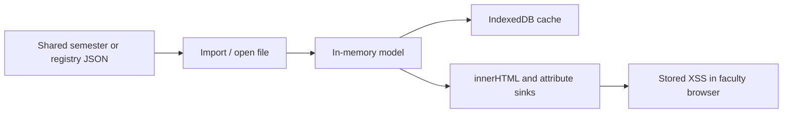

# Security Review Design Document

**Date:** 2026-08-01  
**Scope:** Full codebase review (Vite/vanilla JS clinical & simulation SPA)  
**Status:** Findings and remediation guidance only — no application code was changed in this review.

This document prioritizes vulnerabilities by severity and recommends corrections. It expands on the PR 4 class of issue (DOM text reinterpreted as HTML without escaping meta-characters) and covers storage, import trust, headers, and supply-chain risks.

---

## 1. Threat model

This is a **client-side-only** Vite SPA. Authoritative data lives in college OneDrive / ProgramData (File System Access API). Browser IndexedDB caches copies. In-app roles are UX gating; **OneDrive ACLs are the real access control**.

**Primary attacker:** someone who can write a malicious field into a shared JSON file (student name, group label, proposal text, site name, meta fields) that another faculty member later opens. Same-origin XSS then unlocks IDB (PII + Argon2 hashes).

**PR 4 class:** DOM text reinterpreted as HTML without escaping meta-characters — still present in multiple high-traffic sinks beyond whatever PR 4 fixed.

**Out of scope for this app’s architecture:** remote API auth, server-side injection, SSRF. No `eval` / `new Function` / string timers found in `src/`.

**Sanitization posture:** No DOMPurify or sanitize-html dependency. Escaping is ad hoc via local helpers (`escapeHtml`, `esc`, `escAttr`, `escHtml`) with inconsistent coverage and strength.

---

## 2. Findings by severity

### Critical — stored XSS via unescaped semester/registry fields

| ID | Finding | Location | Why critical |
|----|---------|----------|--------------|
| C1 | Proposal rows build HTML from raw `label`, `before`/`after`, `proposedBy.name`, `p.id` | [`src/ui/setup-proposals.js`](../src/ui/setup-proposals.js) `renderProposalRowHtml` (~120–138) | Proposal values and names come from JSON / faculty edits; assigned via `innerHTML` |
| C2 | Student select options concatenate `s.name` / `s.clinicalGroup` / `s.id` | [`src/ui/student-view.js`](../src/ui/student-view.js) (~46–48) | Classic option-injection; payload in roster name executes on Student View |
| C3 | Conflicts panel joins validator messages (embed `student.name`) into `innerHTML` | [`src/ui/dashboard/index.js`](../src/ui/dashboard/index.js) (~270–272); same pattern in [`src/ui/playground/dashboard.js`](../src/ui/playground/dashboard.js); messages from [`src/core/validator.js`](../src/core/validator.js) | Any malicious roster name fires when dashboard validates |
| C4 | Clinical groups / facilities / group ids interpolated raw into options, `aria-label`, `data-*`, row HTML | [`src/ui/setup-config/clinical-groups.js`](../src/ui/setup-config/clinical-groups.js); group headers in [`src/ui/setup/roster.js`](../src/ui/setup/roster.js); faculty group span in [`src/ui/setup/facilities-faculty.js`](../src/ui/setup/facilities-faculty.js) | Group/site strings from config + site library |
| C5 | Batch export filter options use raw group/name strings | [`src/export/student-calendar-batch.js`](../src/export/student-calendar-batch.js) (~150–155) | Same injection class in export UI |

**Suggested correction (Critical):**

1. Add a single shared module (e.g. `src/ui/html-escape.js`) exporting `escapeHtml` and full `escapeAttr` (`& < > " '`), replacing dozens of local `esc` / weak `escAttr` copies.
2. Prefer `createElement` + `textContent` / `setAttribute` for data-driven rows (especially `<option>`, proposal rows, conflict lists).
3. Where string HTML remains, **every** dynamic fragment must go through `escapeHtml` / `escapeAttr`.
4. Add vitest cases: roster name / group / proposal containing `` must not produce executable DOM.

**Example payload:** a student name or clinical group such as `` or `A"><i x="` in a shared semester JSON executes when those UIs render.

---

### High — partial escaping, weak helpers, privilege amplification via XSS

| ID | Finding | Location | Suggested correction |
|----|---------|----------|----------------------|
| H1 | Dashboard cell / sim table: guest `title`, notes, site initials, groups unescaped; name sometimes escaped | [`src/ui/dashboard/index.js`](../src/ui/dashboard/index.js) `renderCellHtml` and sim/roster sections; [`src/ui/playground/dashboard.js`](../src/ui/playground/dashboard.js) | Escape all interpolated fields; or build cells with DOM APIs |
| H2 | Sim roles: unescaped sim-group keys, `guestTitle`, `data-student` | [`src/ui/sim-roles.js`](../src/ui/sim-roles.js) | Escape text + attributes; validate ids on import |
| H3 | Season / course / semester id class and `data-*` from meta | [`src/ui/semester-label.js`](../src/ui/semester-label.js), [`src/ui/chrome.js`](../src/ui/chrome.js), [`src/ui/course-selector.js`](../src/ui/course-selector.js) | Allowlist `semesterSeason` (`fall`/`spring`); escape `data-*` values |
| H4 | `escAttr` only replaces `"` — not `& < >` | [`src/ui/setup/dom-utils.js`](../src/ui/setup/dom-utils.js) | Replace with full attribute encoder; migrate call sites |
| H5 | `showDialog(title, bodyHtml)` trusts callers | [`src/ui/dialogs.js`](../src/ui/dialogs.js) | Keep API but document “escaped HTML only”; audit callers; prefer `dialogMessageHtml` for plain text |
| H6 | Unencrypted IndexedDB holds semester PII + users registry (Argon2 hashes, emails) | [`src/storage/storage-idb.js`](../src/storage/storage-idb.js), `*storage.js` caches | Treat as sensitive: clear caches on logout; consider not caching registry hashes; document that XSS = full local data theft; optional WebCrypto encryption later |
| H7 | Sim role “obfuscation” is Base64 (`b64v1`), not encryption | [`src/auth/sim-faculty-data.js`](../src/auth/sim-faculty-data.js) | Fix UX copy to “encoded”; keep roles ACL-separated; real encryption only if product requires it |

---

### Medium — import trust, headers, supply chain, path pollution

| ID | Finding | Location | Suggested correction |
|----|---------|----------|----------------------|
| M1 | JSON import: kind checks + migrate, no schema / `__proto__` strip | migrations, `migrateRegistry`, import paths; [`src/core/file-kind.js`](../src/core/file-kind.js) | Schema/allowlist on import; strip `__proto__`/`constructor`/`prototype`; size caps |
| M2 | `setValueAtPath` can assign reserved path segments | [`src/proposals/proposals.js`](../src/proposals/proposals.js) (~153–159) | Reject `__proto__`, `constructor`, `prototype` path parts |
| M3 | No CSP / security headers in app or Vite | [`index.html`](../index.html), [`vite.config.js`](../vite.config.js) | Meta CSP (`default-src 'self'`, no `unsafe-eval`) and/or SharePoint host headers; `frame-ancestors 'none'` |
| M4 | Production `build.sourcemap: true` | [`vite.config.js`](../vite.config.js) | Disable sourcemaps for SharePoint/public builds |
| M5 | Client-only auth; registry file is the secret; weak policy (min length 8); salt fallback uses `Math.random` if crypto missing | [`src/auth/password.js`](../src/auth/password.js), session modules | Document ACL trust; strengthen policy; always require `crypto.getRandomValues` for salts |
| M6 | Temp passwords on clipboard + plaintext `.txt` download | [`src/ui/users-temp-credentials.js`](../src/ui/users-temp-credentials.js) | Auto-clear clipboard; short-lived UI; warn not to leave files on disk |
| M7 | `xlsx@0.18.5` known read-path CVEs; app uses **write-only** | [`package.json`](../package.json), [`src/export/dashboard-export.js`](../src/export/dashboard-export.js) | Replace with write-only lib or SheetJS patched tarball to silence scanners |
| M8 | Schedule filters / site library / theory calendar: unescaped ids in `data-*` or options | [`src/ui/dashboard/schedule-filters.js`](../src/ui/dashboard/schedule-filters.js), [`src/ui/setup-config/site-library.js`](../src/ui/setup-config/site-library.js), [`src/ui/theory/master-calendar.js`](../src/ui/theory/master-calendar.js) | Escape attributes; prefer DOM APIs |

---

### Low / informational

| ID | Finding | Suggested correction |
|----|---------|----------------------|
| L1 | Download filenames from open file / user id less sanitized than export helpers | Central `safeDownloadName()` |
| L2 | `Math.random` for entity ids | Prefer `crypto.randomUUID()` |
| L3 | ProgramData `resolveRelative` lacks explicit `..` reject (Chromium FS usually blocks; mock plugin already guards) | Mirror mock plugin sanitization in [`src/storage/program-data.js`](../src/storage/program-data.js) |
| L4 | PWA SW caches app assets (JSON nav denylist already present) | Keep denylist; careful deploy updates |
| L5 | Dev mock OneDrive HTTP API | Confirm never shipped in production builds (already serve-only) |

---

## 3. Positive controls (keep)

- Argon2id via `hash-wasm`; session in-memory only (cleared each launch)
- File-kind guards before overwrite
- Temp password generation fails closed without `crypto.getRandomValues`
- No third-party script tags / `postMessage` / `javascript:` URL sinks found
- Several modules already escape well (audit closeout, users-admin, student-calendar-html `esc()`, makeup-finder `option.textContent`)

---

## 4. Remediation roadmap

Implement in separate PRs (not part of this documentation deliverable):

1. **P0:** Shared escape helpers + fix C1–C5 + H4; XSS regression tests.
2. **P1:** Dashboard / sim-roles / filters / season allowlist (H1–H3, M8); caller audit for `showDialog`.
3. **P2:** Import hardening (M1–M2); CSP + sourcemap off (M3–M4); sim-roles UX honesty (H7).
4. **P3:** IDB sensitivity docs / cache hygiene (H6); password/clipboard policy (M5–M6); xlsx replacement (M7); Low items.

---

## 5. Checklist coverage (review summary)

| Area | Result |
|------|--------|
| `innerHTML` / `insertAdjacentHTML` | Widespread across UI/export/audit; Critical/High sinks listed above |
| DOMPurify / sanitize library | Absent |
| `eval` / `new Function` / string timers | None found in `src/` |
| Storage / encryption | IDB + small localStorage prefs; **no encryption**; PII + hashes in IDB |
| JSON import | Kind guards + migrate; **no schema / proto stripping** |
| `postMessage` / iframes / 3P scripts | None in app; deps bundled via Vite |
| Dangerous URL protocols | Downloads use `blob:` object URLs |
| CSP / security headers | Absent in HTML/Vite |
| Dependencies | Notable: `xlsx@0.18.5` (write-only usage mitigates read CVEs) |
| Electron / privileged Node in app | No Electron; Node `fs` only in build/dev scripts/tests |
| Regex DoS | No `new RegExp(userInput)`; patterns are fixed literals |
| Service workers | Present via `vite-plugin-pwa`; JSON nav fallback denied |

---

## 6. Related references

- Data policy and pre-push checklist: [README.md](../README.md)
- File-kind guards: [`src/core/file-kind.js`](../src/core/file-kind.js)
- Shared dialog escaping (good pattern to extend): [`src/ui/dialogs.js`](../src/ui/dialogs.js) `escapeHtml` / `dialogMessageHtml`
