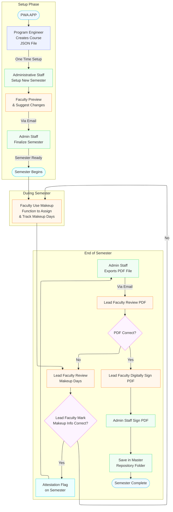

# Audit tracking workflow

Visual overview of semester setup, makeup tracking, and end-of-semester audit closeout. This workflow uses **no Microsoft API login in the app**; the **digitally signed audit PDF** in the master repository is the official record after closeout.

**Operations guide (admin & faculty):** [docs/AUDIT_TRACKING_OPERATIONS.md](docs/AUDIT_TRACKING_OPERATIONS.md)

**Developer implementation guide:** [docs/AUDIT_TRACKING_IMPLEMENTATION.md](docs/AUDIT_TRACKING_IMPLEMENTATION.md)

## Notes

- **Lead course faculty** (set in Setup) attests makeup records at closeout. This is separate from **clinical group faculty** listed per cohort (C1–C5).
- In-app attestation is a workflow step; **digital signatures on the PDF** (outside the app) provide the official audit trail.
- Working semester data lives in `regn-tracker.json` on OneDrive during the semester; see [docs/ONEDRIVE-SETUP.md](docs/ONEDRIVE-SETUP.md).
